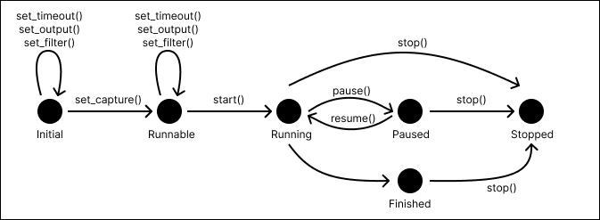
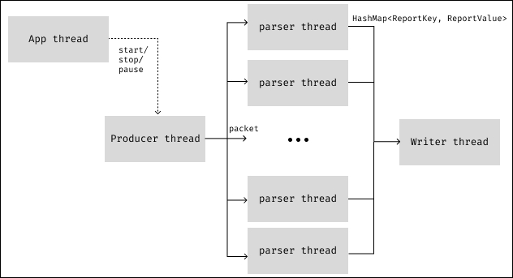

# Nasoone-lib

It's a multithreading Rust library for collecting network data and generating reports. It is used in [Nasoone](https://github.com/davideaimar/nasoone).

It generates a report in this form:

```text
source ip; source port; destination ip; destination port; protocols; first; last; bytes; packets
```

Where `source ip`, `source port`, `destination ip` and `destination port` uniquely identify a connection (they're like the primary key of the report).
The other fields give information on that connection:
 - `protocols` is a list of protocols used in the connection (typically one between UDP or TCP, but could be both)
 - `first` and `last` are the first and last timestamps (in milliseconds) of the packets detected in the connection
 - `bytes` is the number of bytes transferred in the connection
 - `packets` is the number of packets transferred in the connection. 

## State machine diagram

This library exposes a struct `Nasoone` that behaves like a state machine. You can see the behavior of this state machine in the following diagram:



## Multithreading

This library is multithreaded. It uses a thread pool to parse packets data. The number of threads is set to the number of logical cores of the machine.

This image shows the threads used by the library:


 
 - The `App thread` is the one that 'calls' the library
 - The `Producer thread` is the one that gets the packets from the underlying pcap library, copy the data and send it to one `parser thread` through a channel.
 - The `Parser threads` are the ones that parse the packets data and send the result to the `Writer thread` periodically.
 - The `Writer thread` is the one that writes the data to the report file, at an interval specified by the user.

## Report example

Here is an example of a report generated by the library:

```text
source ip; source port; destination ip; destination port; protocols; first; last; bytes; packets
192.168.1.60; 50679; 255.255.255.255; 6667; [UDP]; 1672060820555; 1672060820555; 214; 1
192.168.1.20; 20213; 103.195.103.66; 9993; [UDP]; 1672060821134; 1672060821134; 179; 1
140.82.112.22; 443; 192.168.1.20; 53673; [TCP]; 1672060821867; 1672060822494; 5228; 11
192.168.1.20; 53673; 140.82.112.22; 443; [TCP]; 1672060821764; 1672060822393; 3802; 11
50.7.252.138; 9993; 192.168.1.20; 35848; [UDP]; 1672060821406; 1672060821406; 671; 1
108.177.119.188; 5228; 192.168.1.20; 52921; [TCP]; 1672060821504; 1672060821504; 66; 1
192.168.1.2; 51057; 224.0.0.251; 5353; [UDP]; 1672060822910; 1672060822910; 84; 1
192.168.1.20; 9993; 103.195.103.66; 9993; [UDP]; 1672060821134; 1672060821134; 179; 1
192.168.1.20; 20213; 84.17.53.155; 9993; [UDP]; 1672060821134; 1672060821134; 179; 1
192.168.1.20; 9993; 84.17.53.155; 9993; [UDP]; 1672060821134; 1672060821134; 179; 1
35.186.224.25; 443; 192.168.1.20; 53631; [TCP]; 1672060822358; 1672060822358; 66; 1
103.195.103.66; 9993; 192.168.1.20; 35848; [UDP]; 1672060821262; 1672060821262; 671; 1
104.194.8.134; 9993; 192.168.1.20; 35848; [UDP]; 1672060821306; 1672060821306; 671; 1
192.168.1.20; 52921; 108.177.119.188; 5228; [TCP]; 1672060821473; 1672060821473; 54; 1
192.168.1.20; 53631; 35.186.224.25; 443; [TCP]; 1672060822346; 1672060822346; 54; 1
192.168.1.20; 35848; 50.7.252.138; 9993; [UDP]; 1672060821134; 1672060821134; 179; 1
192.168.1.2; 49420; 224.0.0.251; 5353; [UDP]; 1672060822808; 1672060822808; 84; 1
192.168.1.20; 35848; 104.194.8.134; 9993; [UDP]; 1672060821134; 1672060821134; 179; 1
192.168.1.20; 9993; 104.194.8.134; 9993; [UDP]; 1672060821134; 1672060821134; 179; 1
192.168.1.20; 20213; 50.7.252.138; 9993; [UDP]; 1672060821134; 1672060821134; 179; 1
192.168.1.20; 35848; 103.195.103.66; 9993; [UDP]; 1672060821134; 1672060821134; 179; 1
192.168.1.20; 35848; 84.17.53.155; 9993; [UDP]; 1672060821134; 1672060821134; 179; 1
84.17.53.155; 9993; 192.168.1.20; 9993; [UDP]; 1672060821170; 1672060821170; 671; 1
192.168.1.20; 9993; 50.7.252.138; 9993; [UDP]; 1672060821134; 1672060821134; 179; 1
192.168.1.73; 58945; 255.255.255.255; 6667; [UDP]; 1672060820453; 1672060820453; 214; 1
192.168.1.20; 20213; 104.194.8.134; 9993; [UDP]; 1672060821134; 1672060821134; 179; 1
```

